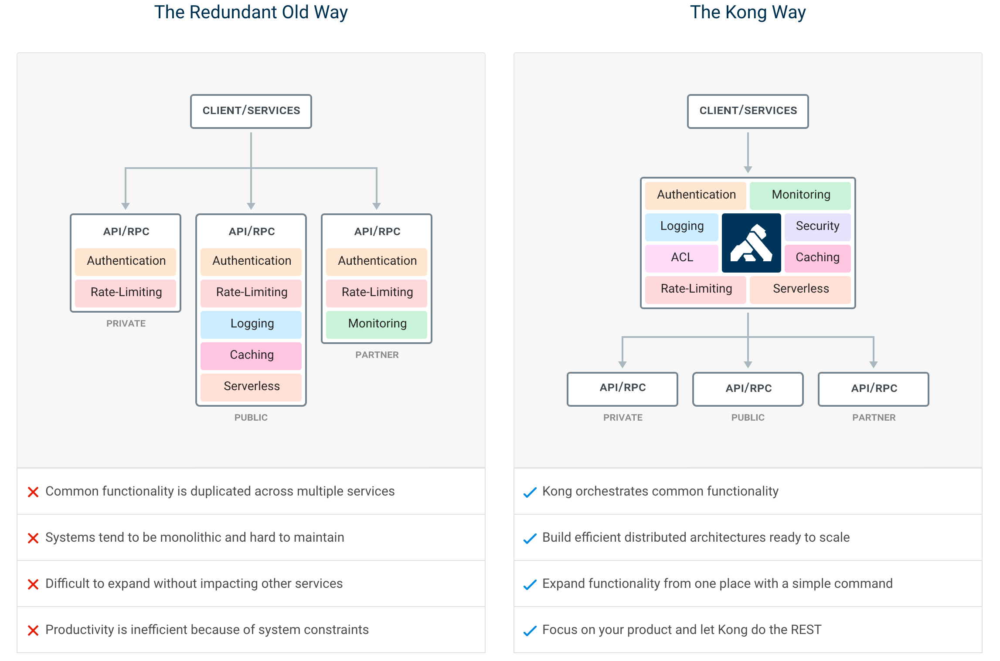
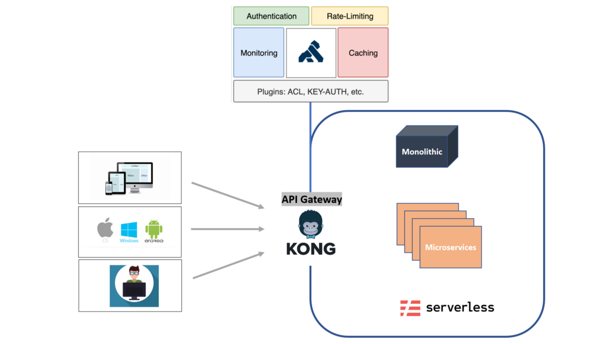
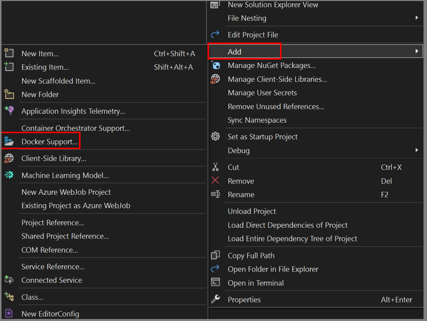

# KONG Gateway Reference

#### Authors: Fiyaz Hasan, Jahedul Hasan

## What is KONG?

Kong is a scalable, open-source API Layer (also known as an API Gateway, or API Middleware). Kong runs in front of any RESTful API and is extended through Plugins, which provide extra functionality and services beyond the core platform. If you are building for web, mobile or IoT (Internet of Things) you will likely end up needing common functionality to run your actual software. Kong can help by acting as a gateway (or a sidecar) for micro-services requests while providing load balancing, logging, authentication, rate-limiting, transformations, and more through plugins.

## Feature of Kong API Gateway:

The top Kong features include:

*	Advanced routing, load balancing, health checking - all configurable via a RESTful admin API or declarative configuration.
*	Authentication and authorization for APIs using methods like JWT, Basic Auth, OAuth, ACLs and more.
*	Proxy, SSL/TLS termination, and connectivity support for L4 or L7 traffic.
*	Plugins for enforcing traffic controls, rate limiting, request/response transformations, logging, monitoring, and including a plugin developer hub.
*	Sophisticated deployment models like Declarative Database-less Deployment and Hybrid Deployment (control plane/data plane separation) without any vendor lock-in.
*	Native ingress controller support for serving Kubernetes.



## Kong API Gateway with .NET 6 and Docker: 

When we have multiple service consumers, the API gateway architecture can be depicted with the following diagram,



### Creating Sample APIs

Create two Web API projects under a blank solution. Here, the name of the solution is `Kong`

```
Kong
|
- ProductAPI 
- OrderAPI
```

Use Visual Studio to add docker support to individual projects.



If Visual Studio is not installed, add the following `Dockerfile` files to ProductApi and OrderApi respectively,

`/ProductApi/Dockerfile`

```
FROM mcr.microsoft.com/dotnet/aspnet:6.0 AS base
WORKDIR /app
EXPOSE 80
EXPOSE 443

FROM mcr.microsoft.com/dotnet/sdk:6.0 AS build
WORKDIR /src
COPY ["ProductApi/ProductApi.csproj", "ProductApi/"]
RUN dotnet restore "ProductApi/ProductApi.csproj"
COPY . .
WORKDIR "/src/ProductApi"
RUN dotnet build "ProductApi.csproj" -c Release -o /app/build

FROM build AS publish
RUN dotnet publish "ProductApi.csproj" -c Release -o /app/publish /p:UseAppHost=false

FROM base AS final
WORKDIR /app
COPY --from=publish /app/publish .
ENTRYPOINT ["dotnet", "ProductApi.dll"]
```

`/OrderApi/Dockerfile`

```
FROM mcr.microsoft.com/dotnet/aspnet:6.0 AS base
WORKDIR /app
EXPOSE 80
EXPOSE 443

FROM mcr.microsoft.com/dotnet/sdk:6.0 AS build
WORKDIR /src
COPY ["OrderApi/OrderApi.csproj", "OrderApi/"]
RUN dotnet restore "OrderApi/OrderApi.csproj"
COPY . .
WORKDIR "/src/OrderApi"
RUN dotnet build "OrderApi.csproj" -c Release -o /app/build

FROM build AS publish
RUN dotnet publish "OrderApi.csproj" -c Release -o /app/publish /p:UseAppHost=false

FROM base AS final
WORKDIR /app
COPY --from=publish /app/publish .
ENTRYPOINT ["dotnet", "OrderApi.dll"]
```

To build one of the image, run the following command from the root of the solution,

> docker build -f "ProductApi/Dockerfile" -t productapi .

Run the container with the following command,

> docker run -p 7000:80 -it productapi

To run these projects with local SSL certificates, it is suggested to use docker-compose. The docker-compose file created on the root of the solution,

`Kong/docker-compose.yml`

```
version: '3.4'

services:
  productapi:
    container_name: Product
    image: ${DOCKER_REGISTRY-}productapi
    build:
      context: .
      dockerfile: ProductApi/Dockerfile

  orderapi:
    container_name: Order
    image: ${DOCKER_REGISTRY-}orderapi
    build:
      context: .
      dockerfile: OrderApi/Dockerfile

networks: 
  default:
    name: kong-gateway-network
```

`Kong/docker-compose.override.yml`

```
version: '3.4'

services:
  productapi:
    environment:
      - ASPNETCORE_ENVIRONMENT=Development
      - ASPNETCORE_URLS=https://+:443;http://+:80
    ports:
      - "7000:80"
      - "7001:443"
    volumes:
      - ${APPDATA}/Microsoft/UserSecrets:/root/.microsoft/usersecrets:ro
      - ${APPDATA}/ASP.NET/Https:/root/.aspnet/https:ro
  orderapi:
    environment:
      - ASPNETCORE_ENVIRONMENT=Development
      - ASPNETCORE_URLS=https://+:443;http://+:80
    ports:
      - "7002:80"
      - "7003:443"
    volumes:
      - ${APPDATA}/Microsoft/UserSecrets:/root/.microsoft/usersecrets:ro
      - ${APPDATA}/ASP.NET/Https:/root/.aspnet/https:ro
```

Use the following command to run the containers in the background,

> docker-compose -f docker-compose.yml -f docker-compose.override.yml up -d

Use the following command to stop the containers,

> docker-compose -f docker-compose.yml -f docker-compose.override.yml down

### KONG Gateway Container

KONG can be configured to run without a database. Nevertheless, we used postgres for handling kong resources,

* Create a `postgres` database container

    > docker run -d --name kong-database --network=kong-gateway-network -p 5432:5432 -e "POSTGRES_USER=kong" -e "POSTGRES_DB=kong" -e "POSTGRES_PASSWORD=kong" postgres:14.1-alpine

* Run the database container with the following command,

    > docker run --rm --network=kong-gateway-network --link kong-database:kong-database -e "KONG_DATABASE=postgres" -e "KONG_PG_HOST=kong-database" -e "KONG_PG_USER=kong" -e "KONG_PG_PASSWORD=kong" kong kong migrations bootstrap 

* Start KONG container,
    
    > docker run -d --name kong-gateway --network=kong-gateway-network --link kong-database:kong-database -e "KONG_DATABASE=postgres" -e "KONG_PG_HOST=kong-database" -e "KONG_PG_PASSWORD=kong" -e "KONG_PROXY_ACCESS_LOG=/dev/stdout" -e "KONG_ADMIN_ACCESS_LOG=/dev/stdout" -e "KONG_PROXY_ERROR_LOG=/dev/stderr" -e "KONG_ADMIN_ERROR_LOG=/dev/stderr" -e "KONG_ADMIN_LISTEN=0.0.0.0:8001, 0.0.0.0:8444 ssl" -p 8000:8000 -p 8443:8443 -p 127.0.0.1:8001:8001 -p 127.0.0.1:8444:8444 kong

Verify KONG is up and running with following command,

> curl --head http://localhost:8001/

You should get a response like this,

```
HTTP/1.1 200 OK
Date: Thu, 22 Sep 2022 10:37:56 GMT
Content-Type: application/json; charset=utf-8
Connection: keep-alive
Access-Control-Allow-Origin: *
Content-Length: 13172
X-Kong-Admin-Latency: 5
Server: kong/3.0.0
```

To get the Kong Gateway configuration information. Use the following command,

> curl -s localhost:8001

You should get a large JSON object representing the Gateway configuration

#### Optional 

The `docker-compose-kong.yml` file if you want to run the `KONG` services in orchestration,

```
version: '3.4'

services:
  kong-database:
    image: postgres:14.1-alpine
    container_name: kong-database
    ports:
      - 5432:5432
    environment:
      - POSTGRES_USER=kong
      - POSTGRES_DB=kong
      - POSTGRES_PASSWORD=kong
    volumes:
      - "db-data-kong-postgres:/var/lib/postgresql/data"

  kong-migrations:
    image: kong
    environment:
      - KONG_DATABASE=postgres
      - KONG_PG_HOST=kong-database
      - KONG_PG_PASSWORD=kong
      - KONG_CASSANDRA_CONTACT_POINTS=kong-database
    command: kong migrations bootstrap
    restart: on-failure
    depends_on:
      - kong-database

  kong-gateway:
    image: kong
    container_name: kong
    environment:
      - LC_CTYPE=en_US.UTF-8
      - LC_ALL=en_US.UTF-8
      - KONG_DATABASE=postgres
      - KONG_PG_HOST=kong-database
      - KONG_PG_USER=kong
      - KONG_PG_PASSWORD=kong
      - KONG_CASSANDRA_CONTACT_POINTS=kong-database
      - KONG_PROXY_ACCESS_LOG=/dev/stdout
      - KONG_ADMIN_ACCESS_LOG=/dev/stdout
      - KONG_PROXY_ERROR_LOG=/dev/stderr
      - KONG_ADMIN_ERROR_LOG=/dev/stderr
      - KONG_ADMIN_LISTEN=0.0.0.0:8001, 0.0.0.0:8444 ssl
    restart: on-failure
    ports:
      - 8000:8000
      - 8443:8443
      - 8001:8001
      - 8444:8444
    links:
      - kong-database:kong-database
    depends_on:
      - kong-migrations

networks: 
  default:
    name: kong-gateway-network
```

> Use this [link](https://github.com/Kong/docker-kong/blob/master/compose/docker-compose.yml) to get the docker-compose file (with custom configurations) for KONG

Find more information [here](https://hub.docker.com/_/kong) on running `KONG` with custom configurations.

## Configuring KONG Services and Routes

In Kong Gateway, a service is an abstraction of an existing upstream application. Services can store collections of objects like plugin configurations, and policies, and they can be associated with routes. A route is a path to a resource within an upstream application. Routes are added to services to allow access to the underlying application.


### Creating a Service

Run the following command to register the ProductApi as a service,

> curl -i -s -X POST http://localhost:8001/services --data name=roduct_service --data url="http://host.docker.internal:7000"

You should get a `201 Created` response if the service is registered successfully

```
HTTP/1.1 201 Created
Date: Thu, 22 Sep 2022 11:00:59 GMT
Content-Type: application/json; charset=utf-8
Connection: keep-alive
Access-Control-Allow-Origin: *
Content-Length: 375
X-Kong-Admin-Latency: 15
Server: kong/3.0.0

{"id":"fbbb8a98-d5b2-47d0-8b80-6b75e1d01917","retries":5,"name":"product_service","enabled":true,"tags":null,"ca_certificates":null,"client_certificate":null,"created_at":1663844459,"updated_at":1663844459,"path":"/","connect_timeout":60000,"write_timeout":60000,"read_timeout":60000,"protocol":"http","tls_verify":null,"host":"localhost","tls_verify_depth":null,"port":7000}
```

> The non-ssl running port of the `Product` inside the `kong-gateway-network` bridge is `http://productapi:7000/` 

You can list all current services by sending a GET request to the base /services URL.

> curl -X GET http://localhost:8001/services

```
{"next":null,"data":[{"id":"fbbb8a98-d5b2-47d0-8b80-6b75e1d01917","retries":5,"name":"product_service","enabled":true,"tags":null,"ca_certificates":null,"client_certificate":null,"created_at":1663844459,"updated_at":1663844459,"path":"/","connect_timeout":60000,"write_timeout":60000,"read_timeout":60000,"protocol":"http","tls_verify":null,"host":"localhost","tls_verify_depth":null,"port":7000}]}
```

Configure a new route on the `/api/product` path to direct traffic to the product_service service created earlier:

> curl -i -X POST http://localhost:8001/services/product_service/routes --data "paths[]=/product" --data name=product_route

You should get a `201 Created` response if the route is added successfully,

```
HTTP/1.1 201 Created
Date: Thu, 22 Sep 2022 11:33:43 GMT
Content-Type: application/json; charset=utf-8
Connection: keep-alive
Access-Control-Allow-Origin: *
Content-Length: 492
X-Kong-Admin-Latency: 16
Server: kong/3.0.0

{"paths":["/api/product"],"methods":null,"id":"89a8d5e4-51aa-4c39-bf00-32fa60dbc41d","destinations":null,"snis":null,"name":"product_route","tags":null,"regex_priority":0,"created_at":1663846423,"updated_at":1663846423,"path_handling":"v0","service":{"id":"fbbb8a98-d5b2-47d0-8b80-6b75e1d01917"},"request_buffering":true,"response_buffering":true,"sources":null,"hosts":null,"strip_path":true,"headers":null,"https_redirect_status_code":426,"preserve_host":false,"protocols":["http","https"]}
```

List out all the configured routes,

> curl http://localhost:8001/routes

```
{"next":null,"data":[{"paths":["/api/product"],"methods":null,"id":"89a8d5e4-51aa-4c39-bf00-32fa60dbc41d","destinations":null,"snis":null,"name":"product_route","tags":null,"regex_priority":0,"created_at":1663846423,"updated_at":1663846423,"path_handling":"v0","service":{"id":"fbbb8a98-d5b2-47d0-8b80-6b75e1d01917"},"request_buffering":true,"response_buffering":true,"sources":null,"hosts":null,"strip_path":true,"headers":null,"https_redirect_status_code":426,"preserve_host":false,"protocols":["http","https"]}]}
```

Once the service and route is configured, you can access the underlying product API endpoints in the following way,

> http://localhost:8000/product/api/product

```
[
    {
        "id": 1,
        "name": "Apple",
        "price": 50
    },
    {
        "id": 2,
        "name": "Banana",
        "price": 10
    },
    {
        "id": 3,
        "name": "Guava",
        "price": 30
    }
]
```

Do the same thing for the `OrderApi` as well