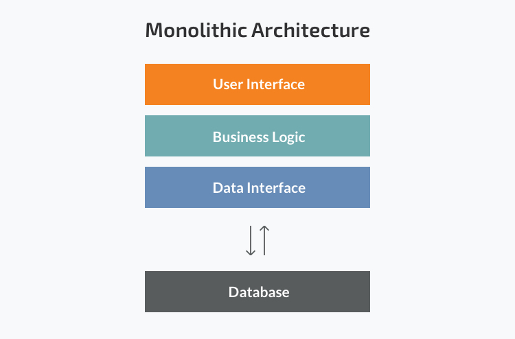
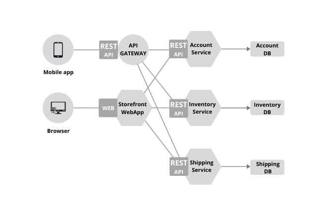

# Ocelot Gateway Reference

#### Authors: Jahedul Hasan, Rafiqul Islam Robin, Fiyaz Hasan

## What is API Gateway?

The API Gateway is a server. It is a single entry point into a system. API Gateway encapsulates the 
internal system architecture. It provides an API that is tailored to each client. It also has other 
responsibilities such as authentication, monitoring, load balancing, caching, request shaping and 
management, and static response handling. All the requests made by the client go through the API 
Gateway. After that, the API Gateway routes requests to the appropriate micro-service. It has many 
advantage like,

* Increase revenue
* Improve developer productivity
* Reduce downtime/ Slow performance

There are many API Gateway solutions available,

* Ocelot
* Envoy
* KONG
* Azure API Management.
* Amazon API Gateway.

## Microservice Architecture

Two possible ways to build and structure an application: 

* Monolith: Monolith is a big container, wherein all the software components of an 
app are assembled and tightly coupled. Each component fully depends on the other. It has 
many disadvantages like,

    * Slow Development
    * Unreliable 
    * Large and Complex 



* Microservice: Microservices Architecture refers to a technique that gives 
modern developers a way to design highly scalable, flexible applications by decomposing the 
application into discrete services that implement specific business functions. These services, 
often referred to as “Loosely Coupled,” can be built, deployed, and scaled independently.



## Ocelot API Gateway

There are some facilities of Ocelot API Gateway

* An Open-source API Gateway for .NET platform.
* Lightweight and run on platform that supports ASP.NET Core.
* Provide all the necessary feature of an API Gateway.
* Used by Microsoft itself for their project.

There are many features of Ocelot API Gateway. Here we discuss some of the major features

### Routing

Create two Web API project name as `OrderAPI` and `ProductAPI`. Both of the projects have controllers (ProductController, OrderController) for handling HTTP requests. Here are the controllers,

`OrderAPI/Controller/OrderController.cs`

```
[ApiController]
[Route("[controller]")]
public class OrderController : ControllerBase
{

    private readonly ILogger<OrderController> _logger;

    public OrderController(ILogger<OrderController> logger)
    {
        _logger = logger;
    }

    [HttpGet(Name = "Order")]
    public IActionResult Get()
    {
        try
        {
            //Thread.Sleep(7000);
            List<OrderModel> products = new List<OrderModel>();
            products.Add(new OrderModel() { Id = 1, Name = "Apple", Unit = "Kg", Qty = 4, TotalAmount = 150 });
            products.Add(new OrderModel() { Id = 2, Name = "Orange", Unit = "Kg", Qty = 3, TotalAmount = 160 });
            products.Add(new OrderModel() { Id = 3, Name = "Banana", Unit = "Kg", Qty = 2, TotalAmount = 170 });

            return Ok(products);

        }
        catch (Exception ex)
        {

            return BadRequest(ex.Message);
        }
    }
}
```

`ProductAPI/Controller/ProductController.cs`

```
[ApiController]
[Route("[controller]")]
public class ProductController : ControllerBase
{
    private readonly ILogger<ProductController> _logger;

    public ProductController(ILogger<ProductController> logger)
    {
        _logger = logger;
    }

    [HttpGet(Name = "Product")]
    public IActionResult Get()
    {
        try
        {
            List<ProductModel> products = new List<ProductModel>
            {
                new ProductModel() { Id = 1, Name = "Apple", Price = 150 },
                new ProductModel() { Id = 2, Name = "Orange", Price = 160 },
                new ProductModel() { Id = 3, Name = "Banana", Price = 170 }
            };

            return Ok(products);

        }
        catch (Exception ex)
        {
            return BadRequest(ex.Message);
        }
    }
}
```

Create another API project name as ApiGateway. Here, we have to register Ocelot. Use `dotnet-cli` to add `Ocelot`

> dotnet add package Ocelot

First of all create SSL certificate with the command line 

> dotnet dev-certs https --trust

Create a JSON file in this project named `Ocelot.json`. The file contains configuration for routing request from upstream Gateway to downstream APIs,

```
{
  "Routes": [
    {
      "DownstreamPathTemplate": "/Product",
      "DownstreamScheme": "https",
      "DownstreamHostAndPorts": [
        {
          "Host": "localhost",
          "Port": 7229
        }
      ],
      "UpstreamPathTemplate": "/api/Product",
      "UpstreamHttpMethod": [ "Get" ]
    },
    {
      "DownstreamPathTemplate": "/Order",
      "DownstreamScheme": "https",
      "DownstreamHostAndPorts": [
        {
          "Host": "localhost",
          "Port": 7104
        }
      ],
      "UpstreamPathTemplate": "/api/Order",
      "UpstreamHttpMethod": [ "Get" ]
    }
  ],
  "GlobalConfiguration": {
    "BaseUrl": "https://localhost:7017"
  }
}
```

Register Ocelot and `Ocelot.json` file to the `Program.cs` 

```
builder.Configuration.AddJsonFile("Ocelot.json");
builder.Services.AddOcelot();
```

And add Ocelot to the HTTP pipeline,

```
await app.UseOcelot();
```

Run all three projects and check the endpoint with the UpstreamPath that you set in `Ocelot.json`. 

> baseURLGlobalConfiguration(Ocelot.json)/Product

> baseURLGlobalConfiguration(Ocelot.json)/Order

### Authentication

In order to authenticate Routes and subsequently use any of Ocelot’s claims based features such as authorization or modifying the request with values from the token. Users must register authentication services in their Startup.cs as usual but they provide a scheme (authentication provider key) with each registration e.g.

```
var authenticationProviderKey = "TestKey";

builder.Services.AddAuthentication()
       .AddJwtBearer(authenticationProviderKey, x =>{});

```

In this example TestKey is the scheme that this provider has been registered with. We then map this to a Route in the configuration e.g.

```
"Routes": [{
        "DownstreamHostAndPorts": [
            {
                "Host": "localhost",
                "Port": 7229,
            }
        ],
        "DownstreamPathTemplate": "/Product",
        "UpstreamPathTemplate": "/api/Product",
        "UpstreamHttpMethod": ["Post"],
        "RouteIsCaseSensitive": false,
        "DownstreamScheme": "https",
        "AuthenticationOptions": {
            "AuthenticationProviderKey": "TestKey",
            "AllowedScopes": []
        }
    }]
```

When Ocelot runs it will look at this Routes AuthenticationOptions.AuthenticationProviderKey and check that there is an Authentication provider registered with the given key. If there isn’t then Ocelot will not start up, if there is then the Route will use that provider when it executes.

### Authorization

Ocelot supports claims based authorization which is run post authentication. This means if you have a route you want to authorize you can add the following to you Route configuration.

```
"RouteClaimsRequirement": {
    "UserType": "registered"
}
```

In this example when the authorization middleware is called Ocelot will check to see if the user has the claim type UserType and if the value of that claim is registered. If it isn’t then the user will not be authorized and the response will be 403 forbidden.

### Request Aggregation

Ocelot allows us to specify Aggregate Routes that compose multiple normal Routes and map their responses into one object. This is usually where we have a client that is making multiple requests to a server where it could just be one. This feature allows us to start implementing back end for a front-end type architecture with Ocelot.
  

#### Implementation

We require a key for each API endpoint that we want to integrate in our `Ocelot.json` file,
  
```
[
  {
    "DownstreamPathTemplate": "/Product",
    "DownstreamScheme": "https",
    "DownstreamHostAndPorts": [
      {
        "Host": "localhost",
        "Port": 7229
      }
    ],
    "UpstreamPathTemplate": "/api/Product",
    "UpstreamHttpMethod": [
      "Get"
    ],
    "Key": "ProductKey"
  },
  {
    "DownstreamPathTemplate": "/Order",
    "DownstreamScheme": "https",
    "DownstreamHostAndPorts": [
      {
        "Host": "localhost",
        "Port": 7104
      }
    ],
    "UpstreamPathTemplate": "/api/Order",
    "UpstreamHttpMethod": [
      "Get"
    ],
    "Key": "OrderKey"
  }
]
 ```

* We have two endpoints, each of which contains a `Key` section with a different unique key.
* We have to merge these keys in `Aggregates` settings section. It must be outside of the `Routes` settings,

```
{
  "Aggregates": [
    {
      "RouteKeys": [
        "ProductKey",
        "OrderKey"
      ],
      "UpstreamPathTemplate": "/api/productorder"
    }
  ]
}

```

* `UpstreamPathTemplate` setting carry the common path where we get the compose result.
* If the Route `/Product` returned a body of `{ "Name": "Apple" }` and `/Order` returned `{ "Qty": 2 }` the response after aggregation would be as follows,

```
{
  "ProductKey": {
    "Name": "Apple"
  },
  "OrderKey": {
    "Qty": 2
  }
}
```

### Rate Limiting

Rate limiting is a technique used to control the number of requests a user can make to an API over a given period of time. It's usually used to prevent abuse or  misuse of the API. Ocelot supports rate limiting of upstream requests so that our downstream services do not become overloaded. 

#### Implementation

To get rate limiting working for a Route we need to add the following configuration in the `Ocelot.json` file,

```
{
  "RateLimitOptions": {
    "ClientWhitelist": [],
    "EnableRateLimiting": true,
    "Period": "5s",
    "PeriodTimespan": 5,
    "Limit": 1
  }
}
```

* `ClientWhitelist` - An array that contains the white-listed clients. It means that the client in this array will not be affected by the rate limiting.
* `EnableRateLimiting` - Enable or disable endpoint rate limiting.
* `Period` - This value specifies the period that the limit applies to, such as `1s`, `5m`, `1h`, `1d` and so on. If we make more requests in the period than the limit allows, we need to wait for `PeriodTimespan` to elapse before we make another request.
* `PeriodTimespan` - This value specifies that we can retry after a certain number of seconds.
* `Limit` - This value specifies the maximum number of requests that a client can make in a defined period.

> If we want to change default prompt, remove the response header of rate limiting and change the response status code then we need to add some global configuration

```
{
  "GlobalConfiguration": {
    "BaseUrl": "https://localhost:7017",
    "RateLimitOptions": {
      "DisableRateLimitHeaders": false,
      "QuotaExceededMessage": "Customize Message! Try again after 5 second",
      "HttpStatusCode": 999,
      "ClientIdHeader": "Test"
    }
  }
}
```

* `DisableRateLimitHeaders` - This value specifies whether `X-Rate-Limit` and `Retry-After` headers are disabled.
* `QuotaExceededMessage` - This value specifies the exceeded message.
* `HttpStatusCode` - This value specifies the returned HTTP Status code when rate limiting occurs.
* `ClientIdHeader` - Allows us to specify the header that should be used to identify clients. By default it is `ClientId`.


### Caching

Ocelot supports some very rudimentary caching at the moment provided by the `CacheManager` project. This is an amazing project that is solving a lot of caching problems. Ocelot documentation recommends using this package to cache with Ocelot.

* The following example shows how to add `CacheManager` to Ocelot so that we can do output caching.
* First, we have to add the following NuGet package.

> Install-Package Ocelot.Cache.CacheManager

* The second thing we need to is to register the `CacheManger` service in `Program.cs` file 

```
builder.Services.AddOcelot(builder.Configuration)
    .AddCacheManager( x => 
    x.WithDictionaryHandle());
```

* Finally in order to use caching on a route in our Route configuration add this setting.

```
{
  "FileCacheOptions": {
    "TtlSeconds": 30,
    "Region": "somename"
  }
}
```

* In this example `TtlSeconds` is set to `30` which means the cache will expire after `30` seconds

### Own Caching

* If we want to add our own caching implementation, register the interface with the DI container
* `services.AddSingleton<IOcelotCache<CachedResponse>, MyCache>()`
* `IOcelotCache<CachedResponse>` this is for output caching.
* `IOcelotCache<FileConfiguration>` this is for caching the file configuration if we are remotely getting the configuration such as `Consul`.


### Quality of Service

* Ocelot supports one QoS capability at the current time. We can set on a per Route basis if we want to use a circuit breaker when making requests to a downstream service.
* The first thing we need to do if we want to use the administration API is bring in the relevant NuGet package.

> Install-Package Ocelot.Provider.Polly

* Then in our `Program.cs` register the service

```
builder.Services.AddOcelot(builder.Configuration)
    .AddPolly();
```

* Then we have to add the following section to a `Route` configuration.

```
{
  "QoSOptions": {
    "ExceptionsAllowedBeforeBreaking": 3,
    "DurationOfBreak": 1000,
    "TimeoutValue": 5000
  }
}
```

* `ExceptionsAllowedBeforeBreaking`: This value must greater than 0. It means that the circuit breaker will break after a certain number of exceptions occur.
* `DurationOfBreak`: This value specifies how long the circuit breaker will stay open after it is tripped. The unit of this value is milliseconds.
* `TimeoutValue`: This value specifies that a request will automatically be timed out if it takes more than this value. The unit of this value is milliseconds as well.

### Load Balancing 

Load balancing improves the distribution of workloads across multiple computing resources, such as computers, a computer cluster, network links, central processing units, or disk drives. Load balancing aims to optimize resource use, maximize throughput, minimize response time, and avoid overload of any single resource. 

For our API services, Ocelot's load balancer is a software program that is listening on the port where external clients connect to access services.

#### Implementation

* Here I use two API services as one API service to show, which may make us understand more clearly.
* In `Api1` project, it will return a string "From API1".
  
```
public class ValuesController : Controller
{
    // GET api/values
    [HttpGet]
    public string Get()
    {
        return "From API1";
    }
}
```

* In `Api2` project, it will return a string "From API2".

```
public class ValuesController : Controller
{
    // GET api/values
    [HttpGet]
    public string Get()
    {
        return "From API2";
    }
}
```

* After running them up, we will add configuration of Load Balancing to them.
#### Configure Load Balancing
* We need to pay attention to node `DownstreamHostAndPorts` and `LoadBalancerOptions`.
* `DownstreamHostAndPorts` is an array that contains all services' host and port. In this sample, it will contain both `API1` and `API2`.
* The value of `LoadBalancerOptions` node is a string which specifies the scheduling algorithms.
* Here is a sample shows us how to configure.

```
{
  "DownstreamPathTemplate": "/api/values",
  "DownstreamScheme": "https",
  "DownstreamHostAndPorts": [
    {
      "Host": "localhost",
      "Port": 7229
    },
    {
      "Host": "localhost",
      "Port": 7104
    }
  ],
  "UpstreamPathTemplate": "/api/values",
  "LoadBalancerOptions": {
    "Type": "RoundRobin"
  },
  "UpstreamHttpMethod": [ "Get" ]
},
```

* The above configuration means that when we visit `http://localhost:7017/`, we will get the result from `http://localhost:7229/api/values` or `http://localhost:7014/api/values`, which is based on the `RoundRobin` load balancer.


### Websockets

* Ocelot supports proxying websocket connections with some extra bits.
* In order to get websocket proxying working with Ocelot we need to do the following,
* In `Program.cs`, add WebSockets services

```
app.UseWebSockets();
app.UseOcelot().Wait();
```

* Then in our `Ocelot.json` add the following to proxy a `Route` using websockets.

```
{
  "DownstreamPathTemplate": "/product",
  "UpstreamPathTemplate": "/ws/product",
  "DownstreamScheme": "ws",
  "DownstreamHostAndPorts": [
    {
      "Host": "localhost",
      "Port": 7229
    }
  ]
}
```

* With this configuration, Ocelot will match any websocket traffic that comes in on `/` and proxy it to `localhost:7229/product`. To make this clearer Ocelot will receive messages from the upstream client, proxy these to the downstream service, receive messages from the downstream service and proxy these to the upstream client.

### SignalR

* Ocelot supports proxying SignalR.
* Install `Microsoft.AspNetCore.SignalR.Client`. We can try other packages but this one is tested.
* Do not run it in IISExpress or install the websockets feature in the IIS features
* In our `Program.cs` we need to tell our application to use `SignalR`.

```
app.UseWebSockets();
app.UseOcelot().Wait();
```

Then in `Ocelot.json` add the following to proxy a `Route` using websockets.

```
{
  "DownstreamPathTemplate": "/product",
  "DownstreamScheme": "ws",
  "DownstreamHostAndPorts": [
    {
      "Host": "localhost",
      "Port": 7229
    }
  ],
  "UpstreamPathTemplate": "/gateway/product",
  "UpstreamHttpMethod": [ "GET" ]
}
```

With this configuration Ocelot will match any SignalR traffic that comes in on `/` and proxy it to `localhost:7229/product`. To make this clearer Ocelot will receive messages from the upstream client, proxy these to the downstream service, receive messages from the downstream service and proxy these to the upstream client

* Not Supported : Unfortunately a lot of Ocelot’s features are non websocket specific such as header and http client stuff. I’ve listed what won’t work below.
  
Tracing, RequestId, Request Aggregation, Rate Limiting, Quality of Service, Middleware Injection, Header Transformation, Delegating Handlers, Claims Transformation, Caching, Authentication, Authorization.

